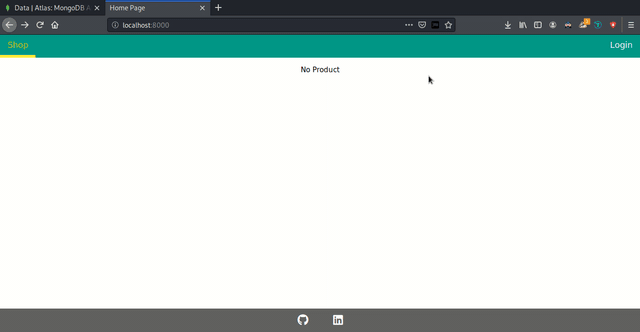
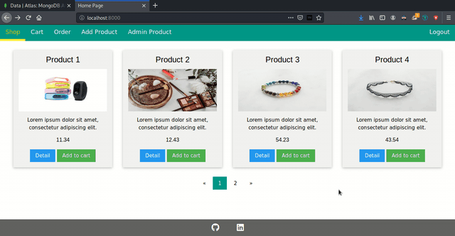
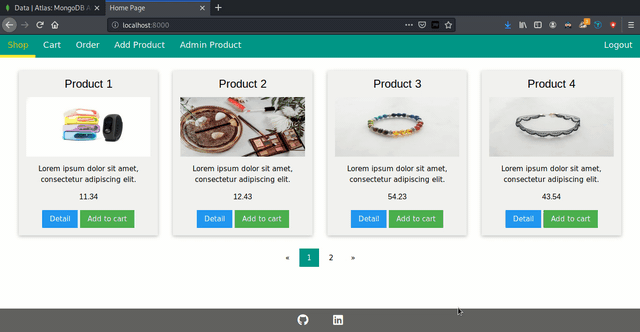

<h1 align="center">Welcome to web-store</h1>

> Build a web application have authenticate, add, edit product from user, order and checkout cart.

## Prerequisites

* node >= 12.14.1
* npm >= 6.13.4

## Install

```sh
npm install
```

Edit the content in .env file with your mongodb uri

## Usage

```sh
npm start
```

## Sreenshot

Authentication



Manage products


Pagination



Payment




## Author

  **thuanhong**
* Website: thuanhong.github.io
* Github: [@thuanhong](https://github.com/thuanhong)
* LinkedIn: [@Thuan Hong](https://www.linkedin.com/in/thuan-hong-48b22618b/)

***
_This README was generated with ❤️ by [readme-md-generator](https://github.com/kefranabg/readme-md-generator)_